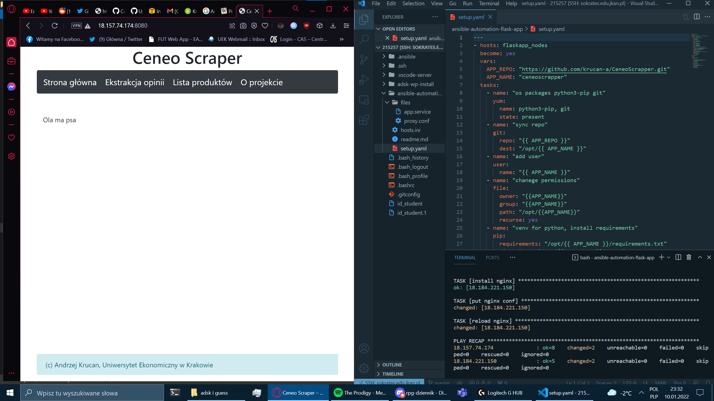

# Zadanie 2  
## Kroki instalacji  
  
1. Stworzenie dwóch maszyn wirtualnych AWS  
2. Połączenie z sokrates.edu.jkan.pl  
3. Stworzenie pliku hosts.ini z zadeklarowaniem dwóch ip maszyn wirtulanych AWS
4. Stworzenie folderu 'files' zawierającego potrzebne pliki konfiguracyjne (*app.service, proxy.conf*)
5. Stworzenie pliku *setup.yaml*
  
```  
Plik setup.yaml zawiera: 
 
Dla aplikacji:
- deklaracje repozytorium aplikacji
- instalację gita
- synchronizacje repozytorium
- nadanie permisji dostępu
- stworzenie wirtualnego srodowiska python3
- rejestrację jako serwis
- uruchomienie serwisu aplikacji

Dla proxy:
- instalację EPEL
- instalację nginx
- konfigurację nginx
```

## Egzekucja setup.yml oraz rezultat
```
ansible-playbook setup.yaml -i hosts.ini
```
